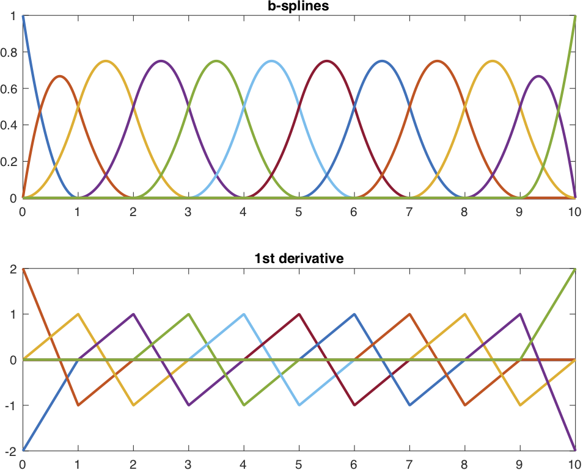
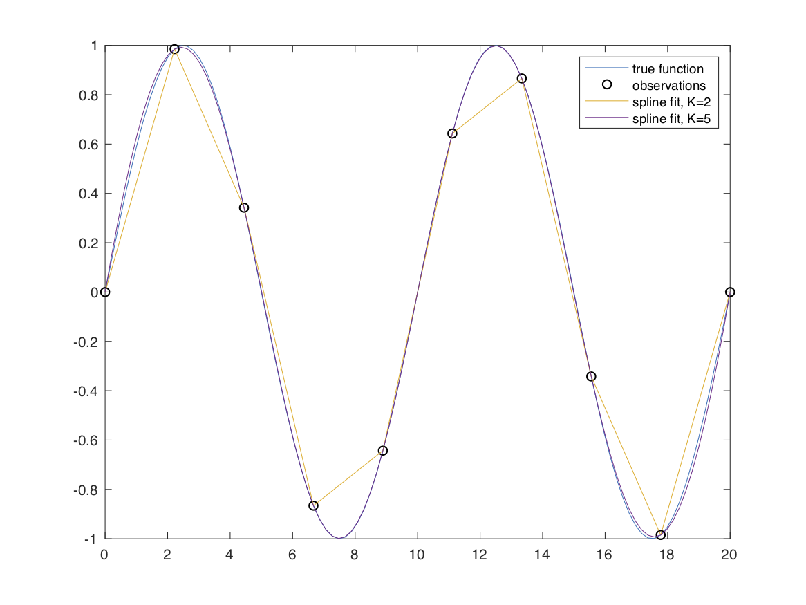

Interpolating splines and b-splines
==============

Core spline classes for interpolation, constrained fitting, tensor-product
construction, and planar trajectories.

The main user-facing workflows in `spline-core` are exact interpolation
with `InterpolatingSpline`, noisy or constrained fitting with
`ConstrainedSpline`, and shared-parameter planar trajectory modeling with
`TrajectorySpline`. The lower-level `BSpline` and `TensorSpline` classes
provide direct access to spline bases, knot sequences, coefficients, and
evaluation.

If you use these classes, please cite the following paper,
- Early, J. J., & Sykulski, A. M. (2020). [Smoothing and Interpolating Noisy GPS Data with Smoothing Splines](https://journals.ametsoc.org/view/journals/atot/37/3/JTECH-D-19-0087.1.xml), *Journal of Atmospheric and Oceanic Technology*, 37(3), 449-465.

### Table of contents
1. [Quick start](#quick-start)
2. [Basis spline](#basis-spline)
2. [Interpolating spline](#interpolating-spline)

------------------------

Quick start
------------

### Interpolating spline

The `InterpolatingSpline` class is useful for interpolating smooth functions. Initialize with data (x,y),
```matlab
x = linspace(0,20,10)';
y = sin(2*pi*x/10);
spline = InterpolatingSpline.fromGriddedValues(x,y)
```
and now you can evaluate the interpolated value,
```matlab
x_dense = linspace(0,20,100)';
y_dense = spline(x_dense);
```
By default the class uses cubic spline, but you can initialize with whatever order of spline you want, e.g.,
```matlab
spline = InterpolatingSpline.fromGriddedValues(x,y,S=4)
```


Overview
------------

The `BSpline` class is a primitive class that creates b-splines given some set of knot points, and then evaluates the splines given some set of coefficients for the splines. This class is just for generating b-splines and doesn't do anything with data.

The main spline classes are:

- `InterpolatingSpline` for exact interpolation on one-dimensional grids and
  rectilinear tensor grids.
- `ConstrainedSpline` for noisy-data fitting, robust fitting, and local or
  global constraints.
- `TrajectorySpline` for planar `x(t), y(t)` models built from a shared
  parameter vector.
- `TensorSpline` for low-level tensor-product spline construction and
  evaluation.
- `BSpline` for low-level one-dimensional spline construction and analysis.

For ordinary scientific setup, prefer the public factories
`InterpolatingSpline.fromGriddedValues(...)`,
`ConstrainedSpline.fromData(...)`,
`ConstrainedSpline.fromGriddedValues(...)` for rectilinear grids,
`TensorSpline.fromKnotPoints(...)`, and
`TrajectorySpline.fromData(...)`. The direct constructors are the cheap
canonical solved-state and persistence path.

Basis spline
------------

The `BSpline` class is a primitive class that creates b-splines given some set of knot points, and then evaluates the splines given some set of coefficients for the splines.

The class would be initialized as follows,
```matlab
S = 3; % spline degree
t = (0:10)'; % observation points

knotPoints = BSpline.knotPointsForDataPoints(t, S=S);
nSplines = numel(knotPoints) - (S + 1);
xi = zeros(nSplines,1);

% initialize the BSpline class
B = BSpline(S=S, knotPoints=knotPoints, xi=xi);
```

If you set the coefficient of one of the splines to 1, e.g.,
```matlab
xi = zeros(nSplines,1);
xi(3) = 1;
B = BSpline(S=S, knotPoints=knotPoints, xi=xi);
```
Then you can plot that particular spline,
```matlab
tq = linspace(min(t),max(t),1000)';
figure, plot(tq,B(tq),'LineWidth',2)
```
Here's an image of all the splines and their first derivatives plotted,
<p align="center"></p>

**Note the usage here that calling `B(t)` evaluates the spline at points
`t`.** Derivatives use
`B.valueAtPoints(t, D=n)` for derivative order `n`.

This class serves as a useful building block for other classes.

Interpolating spline
------------

An interpolating spline uses local b-splines to interpolate across points. The (K-1)th derivative of a K order spline is piecewise continuous.

### Example

Let's start by defining a  function,
```matlab
L = 10;
f = @(x) sin(2*pi*x/L);
```
create a grid of observation points,
```matlab
N = 10;
x = linspace(0,2*L,N)';
```
and then sampling the function at the observation points
```matlab
y = f(x);
```
Let's create a dense grid in x just to better visualize the true function, and the sample points.
```matlab
x_dense = linspace(0,2*L,10*N)';

figure
plot(x_dense,f(x_dense)), hold on
scatter(x,y,'k')
legend('true function', 'observations')
```
Finally, let's use an interpolating spline,
```matlab
spline = InterpolatingSpline.fromGriddedValues(x,y);

figure
plot(x_dense,f(x_dense)), hold on
scatter(x,y,'k')
plot(x_dense,spline(x_dense))
legend('true function', 'observations', 'spline fit')
```
This spline fit is identical to Matlab's built in griddedInterpolant with the 'spline' option,
```matlab
ginterp = griddedInterpolant(x,y,'spline');

residual = ginterp(x_dense)-spline(x_dense);
relative_error = max(abs(residual))/max(abs(y)) % returns O(1e-16)
```
However, unlike Matlab's implementation, this class lets you specify the spline degree directly. Cubic interpolation uses `S=3`, linear interpolation uses `S=1`, and higher-degree fits are also available.
```matlab
spline_1 = InterpolatingSpline.fromGriddedValues(x,y,S=1);
spline_4 = InterpolatingSpline.fromGriddedValues(x,y,S=4);

figure
plot(x_dense,f(x_dense)), hold on
scatter(x,y,'k')
plot(x_dense,spline_1(x_dense))
plot(x_dense,spline_4(x_dense))
legend('true function', 'observations', 'spline fit, S=1', 'spline fit, S=4')
```

<p align="center"></p>

### Options

The `InterpolatingSpline.fromGriddedValues` factory takes name/value pairs to set the spline degree.

- `'S'` spline degree, default is 3.
